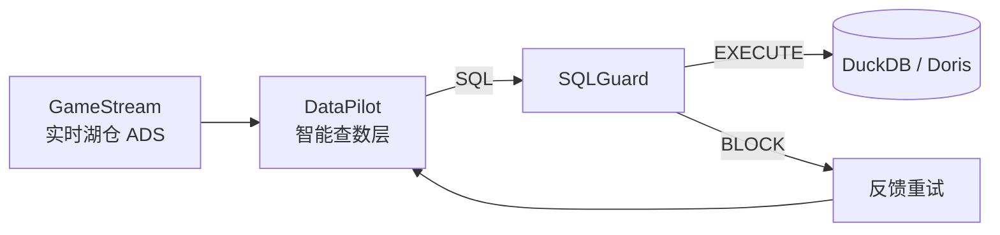

# DataPilot

可选查数层（**optional integration**）：对接 [GameStream](https://github.com/tangyf07/GameStream) 的 ADS 指标口径，经 [SQLGuard](https://github.com/tangyf07/SQLGuard) 门禁后查数解释。不是裸 Text2SQL / 普通 ChatBI 作业。

> 秋招主叙事是 [RetailDW](https://github.com/tangyf07/RetailDW) → [GameStream](https://github.com/tangyf07/GameStream) → [SQLGuard](https://github.com/tangyf07/SQLGuard)。本仓**冻结功能开发**，不占主简历独立项目位。

## 可选集成架构



（可选集成：GameStream 出数 → DataPilot 问数 → SQLGuard 护栏。主项目包不含本仓。）

## 闭环

1. Intent（指标 / 时间 / 可选 server_id）
2. Retrieval（`MockGameStreamRetriever`：**硬编码关键词文档打分**，不是向量 RAG / embedding 检索）
3. Text2SQL（`real` 模型 / `rules` 规则；真实失败则显式 `degraded`）
4. **SQLGuard** 门禁 — BLOCK 时 **一次反馈重试**（`real` 模式重试仍调真实模型，并带上 previous SQL）
5. DuckDB / Doris 执行 — 失败再反馈重试一次
6. 校验 → 自然语言结论 + 表
7. Trace（`traces/`）

最多 **2** 次尝试（1 次重试）。

> **诚实边界：** SQL 执行成功（有行返回）**不等于**答案正确。口径、时间窗、server 过滤仍需人工核对。Retrieval 当前是关键词规则，不是向量库 RAG。

## 指标对齐

口径以 GameStream `config/metrics.yaml` + `sql/metrics/` 为准；本仓 seed / RAG / catalog 使用同一 `metric_id` 与表名（`ads_dau_di`、`ads_retention_nd`、`ads_arpu_di`、`ads_pay_rate_di` 等）。Vendored 副本：`data/gamestream/metrics.yaml`。

## Quickstart

```bash
pip install -e ".[dev]"
# 可选真实门禁：
pip install -e ".[sqlguard]"   # or: pip install -e /path/to/sql-write-gate
python -m datapilot demo
python -m datapilot "昨天DAU多少？"
pytest -q
```

默认无 Key 时 `DATAPILOT_LLM_MODE=rules`（别名 `mock` 仍可用），无需 API Key。


## G7：ChatBI → SQLGuard → GameStream Doris ADS

可选集成真实链路（无 UI）：DataPilot 生成 ADS SQL → **SQLGuard 1.1** `block_or_execute(execute=True)` → Doris FE（MySQL 协议）查 `ads` 库。

**Live Doris demo evidence:** the G7 demo ran **two SELECTs each returning 8 rows** (DAU + pay_rate). That live demo is separate from offline unit tests — **`pytest passed` is not proof of Doris integration**.

Business calendar timezone for time intents (`今天` / `昨天` / `近7天`): **Asia/Shanghai**. `last_7_days` = inclusive window **[today-6d, today]** (7 calendar days including today).

```bash
# Windows 本机 Doris FE 已起时：
pip install -e ".[dev,sqlguard,doris]"   # pymysql + sql-write-gate
# 或: pip install pymysql && pip install -e /path/to/sql-write-gate

$env:DATAPILOT_QUERY_BACKEND='doris'
$env:DATAPILOT_DORIS_URL='mysql://root@127.0.0.1:9030/ads'
$env:DATAPILOT_GUARD_MODE='write_gate'
python -m datapilot g7
# 等价: python demos/run_g7.py
```

| Env | 说明 |
|-----|------|
| `DATAPILOT_QUERY_BACKEND` | `duckdb` \| `doris` \| `auto`（有 URL 且可达则 doris） |
| `DATAPILOT_DORIS_URL` | 默认 `mysql://root@127.0.0.1:9030/ads` |

- 指标：`ads_dau_di` / `ads_pay_rate_di`（与 GameStream metric_id 对齐）
- 门禁 catalog 使用**未限定表名** + `database=ads`（避免 `ads.ads_dau_di` 权限匹配失败）
- Trace 中 `query_path`：`sqlguard_execute`，或 gate 已 ALLOW 但未物化行时的 post-ALLOW `sqlguard_check_then_pymysql`（gate BLOCK/异常时**不会** pymysql 旁路）
- 离线单元测试（DuckDB seed）：`DATAPILOT_QUERY_BACKEND=duckdb pytest -q` — 与 live Doris G7 demo 分开验证
- Suite acceptance (offline, no Doris claim): `pytest -m suite_p0 -q` (or by path)

## LLM modes（诚实标注）

| Mode | Env / alias | Behavior |
|------|-------------|----------|
| `real` | `real` / `openai` | 调用 OpenAI 兼容 API；`SQLGeneration.mode=real` |
| `rules` | `rules` / `mock` | 确定性关键词/规则 SQL；离线默认可跑 |
| `degraded` | `degraded`，或 **real 调用失败后自动** | 回退到 rules，但 **显式** `mode=degraded`，并写 `degraded_from` / `real_model_error`；`meta.real_model_failures` 递增。**绝不当成 silent real 成功** |

未设置 `DATAPILOT_LLM_MODE` 时：有 `OPENAI_API_KEY` → `real`，否则 → `rules`。

反馈重试：在 `real` 模式下会再次调用真实模型（原问题 + previous SQL + error feedback + schema）；仅当这次真实调用失败才 rules/`degraded`。

## Env

| Variable | Default | Notes |
|----------|---------|--------|
| `DATAPILOT_LLM_MODE` | `rules`（无 Key）/ `real`（有 Key） | `real`\|`rules`\|`degraded`（别名 `openai`/`mock`） |
| `OPENAI_API_KEY` / `BASE_URL` / `MODEL` | — | OpenAI-compatible |
| `DATAPILOT_DB_PATH` | `./data/datapilot.duckdb` | DuckDB |
| `DATAPILOT_GUARD_MODE` | `auto` | `auto`\|`write_gate`\|`http`\|`mock` |
| `DATAPILOT_GUARD_CATALOG` | `./data/sqlguard/catalog.json` | ADS catalog |
| `DATAPILOT_GUARD_POLICY` | `./data/sqlguard/policy.yaml` | SELECT policy |
| `DATAPILOT_GAMESTREAM_METRICS` | `./data/gamestream/metrics.yaml` | optional metrics path |
| `DATAPILOT_QUERY_BACKEND` | `auto` | `duckdb`\|`doris`\|`auto` |
| `DATAPILOT_DORIS_URL` | — | Doris FE MySQL URL，如 `mysql://root@127.0.0.1:9030/ads` |
| `DATAPILOT_TRACE_DIR` | `./traces` | JSON traces |

## SQLGuard

默认 **`auto`**：已安装 `sql-write-gate` 时走真实 1.1 DataPilot `BLOCK`/`EXECUTE`（module → http → cli）。**仅** `DATAPILOT_GUARD_MODE=mock` 使用 Mock；真实模式超时/断连/ImportError 等 → **BLOCK**（`fallback: null`），不会 mock 回退。HTTP：`POST /v1/check` | `POST /v1/execute`（不用 `/v1/datapilot`）。见 `docs/sqlguard_contract.md`。

## Evals

Gold-question offline harness (four heuristic metrics): [`evals/`](./evals/) — see [`evals/README.md`](./evals/README.md). Retrieval remains **keyword docs**, not vector RAG.

## English

DataPilot is an **optional** query layer over GameStream ADS metric contracts (`metric_id` / table names), gated by SQLGuard, then explains results. Not bare Text2SQL / ChatBI homework. Primary autumn-recruit narrative is RetailDW → GameStream → SQLGuard; this repo is frozen for feature work.

