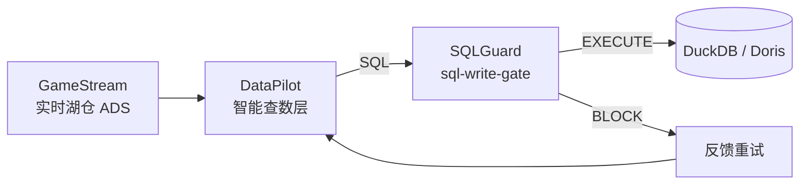

# Architecture



```
Question → Intent → SchemaRetriever (GameStream mock|real)
        → SQLGenerator → SQLGuard.check
             ├─ BLOCK → feedback retry (once) → safer SELECT
             └─ ALLOW/EXECUTE → DuckDB → Validate
                    ├─ fail → feedback retry (once)
                    └─ ok → Conclude + Trace
```

ADS tables (flat DuckDB names, aligned with GameStream `ads.*`):
`ads_dau_di`, `ads_retention_nd`, `ads_arpu_di`, `ads_pay_rate_di`,
`ads_online_duration_di`, `ads_dungeon_clear_rate_di`, `ads_churn_di`.

Adapters: `SchemaRetriever`, `SQLGuardClient` (`mock` | `write_gate`). DataPilot is the glue, not a second warehouse.
